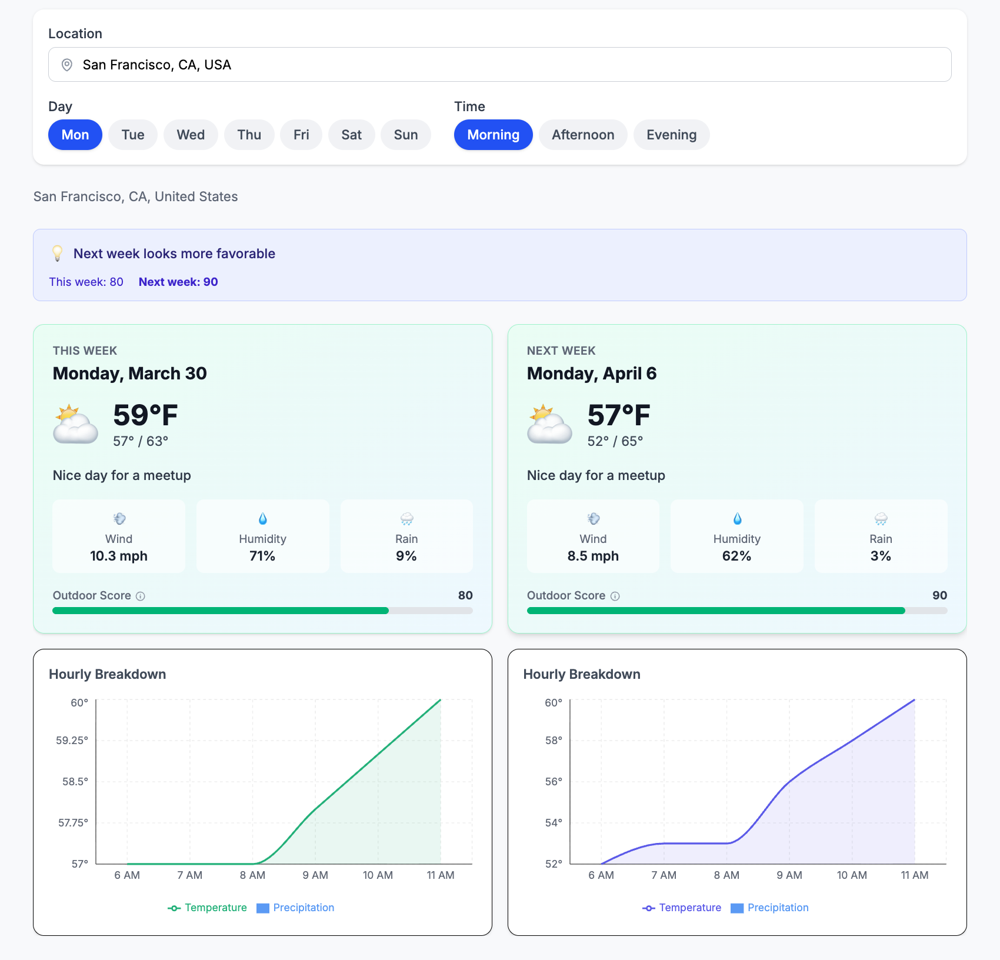

# Tempora

A weather comparison app for outdoor meetup organizers. Pick a day and time window, and Tempora shows this week's forecast side-by-side with next week's — with scoring, recommendations, and hourly charts to help you decide when to meet.



## Features

- **Week-over-week comparison** — see this week vs next week at a glance
- **Smart recommendations** — weighted scoring (0–100) across temperature, wind, precipitation, and humidity
- **Hourly charts** — temperature and precipitation overlaid for your selected time window
- **Google Places autocomplete** — search any park, city, or address
- **Auto-detect location** — uses browser geolocation on first visit
- **Day & time selectors** — Morning / Afternoon / Evening for any day of the week
- **Dark mode** — toggle with system preference detection
- **Persistent preferences** — location, day, time, and theme saved to localStorage

## Tech Stack

| Layer | Choice |
|-------|--------|
| Framework | Next.js 16 (App Router) — server-side API proxy keeps keys off the client |
| UI | React 19 + TypeScript 5.7 (strict) |
| Styling | Tailwind CSS v4 |
| Data fetching | TanStack React Query v5 |
| Charts | Recharts (ComposedChart — temperature area + precipitation bars) |
| Mobile navigation | Embla Carousel v8 |
| Validation | Zod v4 — runtime API response validation + type inference |
| Location | Google Places Autocomplete (`@googlemaps/js-api-loader` v2) |
| Linting | Biome 2.4 |
| Testing | Vitest 4 (unit) + Playwright (e2e) |
| Weather data | Visual Crossing API |
| Package manager | Bun |

## Getting Started

```bash
bun install
cp .env.example .env   # add your API keys
bun dev                # http://localhost:3000
```

### Environment Variables

| Variable | Description |
|----------|-------------|
| `VISUAL_CROSSING_API_KEY` | [Visual Crossing](https://www.visualcrossing.com/) API key (server-side only) |
| `NEXT_PUBLIC_GOOGLE_PLACES_API_KEY` | Google Maps/Places API key (client-side, for autocomplete) |

### Docker

```bash
docker build -t tempora .
docker run -p 3000:3000 --env-file .env tempora
```

## Scripts

```bash
bun dev          # dev server
bun run build    # production build
bun test         # unit tests (Vitest)
bun run test:e2e # e2e tests (Playwright)
bun run lint     # Biome check
bun run lint:fix # Biome auto-fix
bun run format   # Biome format
```

## Architecture

```
app/
  page.tsx              Main page — orchestrates state, geolocation, forecast
  layout.tsx            Root layout with metadata, ErrorBoundary, Providers
  providers.tsx         QueryClientProvider (5min stale time)
  globals.css           Tailwind v4 import + dark mode variant
  api/forecast/
    route.ts            Server-side proxy to Visual Crossing (Zod-validated)

components/
  EventConfig.tsx       Composes LocationInput + ChipSelector (day) + ChipSelector (time)
  LocationInput.tsx     Google Places Autocomplete with ref-based init
  ChipSelector.tsx      Generic chip button group (used for day & time selection)
  WeatherCard.tsx       Weather card with gradient, score bar, stats, tooltip
  HourlyChart.tsx       Recharts ComposedChart (temp area + precip bars)
  ComparisonBanner.tsx  Banner comparing week scores with recommendation
  WeekCarousel.tsx      Embla carousel for mobile week navigation
  ThemeToggle.tsx       Sliding light/dark mode toggle
  ForecastSkeleton.tsx  Pulsing loading skeleton
  ErrorBoundary.tsx     Error boundary with retry

hooks/
  useForecast.ts        React Query wrapper for /api/forecast
  useGeolocation.ts     Browser geolocation + reverse geocode
  useLocalStorage.ts    Generic localStorage with SSR-safe hydration
  useTheme.ts           Dark mode state + localStorage persistence

lib/
  constants.ts          Day/time presets, EventConfig type, getDefaultConfig()
  date-utils.ts         Date range calculation, weekday mapping, hour filtering
  schemas.ts            Zod v4 schemas (single source of truth for types)
  weather.ts            Server-side fetch + Zod validation
  recommendations.ts    scoreWeather (0–100), getWeatherMessage, compareWeeks
  weather-styles.ts     Verdict → Tailwind gradient/border/score classes
```

### Key Decisions

- **Next.js over Vite** — needed server-side API routes to keep the Visual Crossing key off the client
- **Zod schemas as single source of truth** — runtime validation + TypeScript types inferred from the same schemas
- **Scoring engine** — weighted formula across temperature, wind, precipitation, and humidity (0–100 scale)
- **Ref-based callbacks in LocationInput** — avoids re-initializing Google Places autocomplete on every render
- **Cancellable pending submit** — handles Enter key vs Places dropdown race condition
